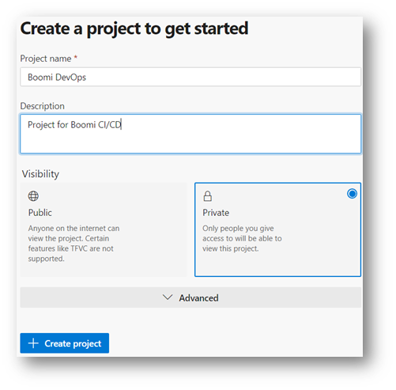

Azure DevOps Release Pipeline
=============================

1 Create Azure DevOps Project
--------------------------------------------

Login to ADO Organization {ORGANIZATION_NAME} from the Azure Portal and create a project: {PROJECT_NAME}. IF you are starting fresh follow the links to create your first organization.

The Azure DevOps Project will can contain multiple repos. This guide will create 2 repos: boomi-cicd-cli-py and boomi-cicd-release. The boomi-cicd-cli-py repo will contain the Boomi CICD CLI scripts and the boomi-cicd-release repo will contain the release pipeline configuration file. Any name for the repos can be used, but the guide will use the names above.

1.3	Import the CI/CD Repo
--------------------------------------------

1.	On the initial repo, click on initialize to have one created. Once it has been created, you will be able to create a new one called boomi-cicd-cli-py.
2.	First go to the officialboomi Bitbucket boomi-cicd-cli-pi repo. This repo will be cloned to create the repo in the new Project. Copy the URL. This URL will be used in Step 4.
3. Navigate back to the new project. Then select Repos on the left -> Repo dropdown -> Import a repository and do not add READMD
4.	Choose Git from drop and set the Clone URL, Check Requires Authentication, and add the URL from Step 2.
5.	The repo will automatically be given the name boomi-cicd-cli-py. This value will be the {BOOMI_CLI_REPO}

1.5	Create Boomi Release Repo
--------------------------------------------

The release repo will be used to store Release Configuration pipeline configuration file. All Integration users must
have contribution access to this repo.

1. Repos -> New Repository -> Repository Name: boomi-cicd-release -> Make sure "Add a README" is checked to initalize the repo -> Click Create

.. image:: assets_ado/create_boomi_release_repo.png
   :width: 100%
   :align: center

3	 Configure the Azure DevOps Library
--------------------------------------------

Configure ADO project to the Boomi Account

1. Under Pipelines go to Library -> Variable group -> + Variable Group
2. Variable group name: boomicicd (this name is used within the pipeline)
3. Description: Account details for Boomi CICD
4. Link secrets if the Azure key/vaults are set up
5. Click +Add to add variables as described in https://github.com/OfficialBoomi/boomicicd-cli/#set-up . There are 20
   variables. Some of them can be blank. The authToken, gitRepoURL and sonarHostToken are secrets.
6. Click on the lock to mask any secrets variables

TODO: Add list of required variables

5	Release Pipelines
--------------------------------------------

5.1	Create a Release Configuration File
--------------------------------------------

A Boomi release configuration file is required to trigger a release pipeline to deploy (automatically or manually) Boomi
components. The templates of Boomi components files are in the Boomi DevOps repos below. A sample configuration file is
provided. Use a directory structure to store configuration files that allows for configuration files to be re-used and
new files to be added. Organize the file to ensure all related components are grouped. A configuration file is a JSON
that can contain an array of JSON objects. Each object contains the metadata to run any Boomi jobs like Deploy Packages,
Create Schedules, Update Environment Extensions, Process Execution and more. The job name within the JSON config
references the script name without spaces and case insensitive( i.e. Deploy Package = deployPackage.sh).

5.2	Import the Release Pipeline
--------------------------------------------

1. Click on Pipelines -> Release -> New -> Import Release Pipeline -> Browse
2. Download the ‘Boomi General Release Pipeline.json’ from the cli/scripts/templates/azure-pipelines/ in Azure Repos and
   select the file and click OK.
3. Add an Azure Repo - Artifactory as shown in the image below
4. Add the agent pipelines for all the stages as shown in the image below
5. Update the environment variable for each of the Stage to match the Boomi Environment as shown in the image below
6. Update the pre-deployment conditions (triggers, approvals) for each stage as shown below
7. Clone an existing stage to add a new stage or delete to remove
8. Click the variables tab and associate the variable library groups from step 4. (ensure it is associated with release
   and stages)
9. Check the pipeline variable (no changes need to be done) enter the configuration file that was created in step a when
   the release is created
10. Hover to the options and retention tabs and make changes as required
11. Ensure the configuration file is updated in the Azure Repo/conf folder
12. Click Save -> Create Release during this step provide the configuration file name to deploy the packages as shown in
    the image below
13. The pipeline script, will read the configuration file and substitute the env variable with the stage env variable

5.2.2	Setup the Agent Job within Tasks
--------------------------------------------

Select the Azure Pipelines agent and ubuntu-22.04 agent. Other agents can be used, but the repo is tested against that
configuration.

5.2.3	Setup the Azure Release Pipeline
--------------------------------------------

5.2.4	Update Environment Variables within Azure Release Pipeline
-------------------------------------------------------------------------

Update the Environment Variables to reflect what is seen below. gitRepoURL should be updated to gitComponentRepoURL.

TODO: Add list of required variables

5.3	Run the Release Pipeline
--------------------------------------------

When the release is created. It will automatically (if pre-deployment options are selected) trigger a deployment to Development Stage and to Test Stage.
Once both are complete. One can manually deploy to Production stage. Any changes to the configuration file will require a new release to be created and triggered. This ensure the configuration file is deployed to all required stages.

Click on each stage to view the logs. Finally select the Production stage and click Deploy to begin a manual deployment.

